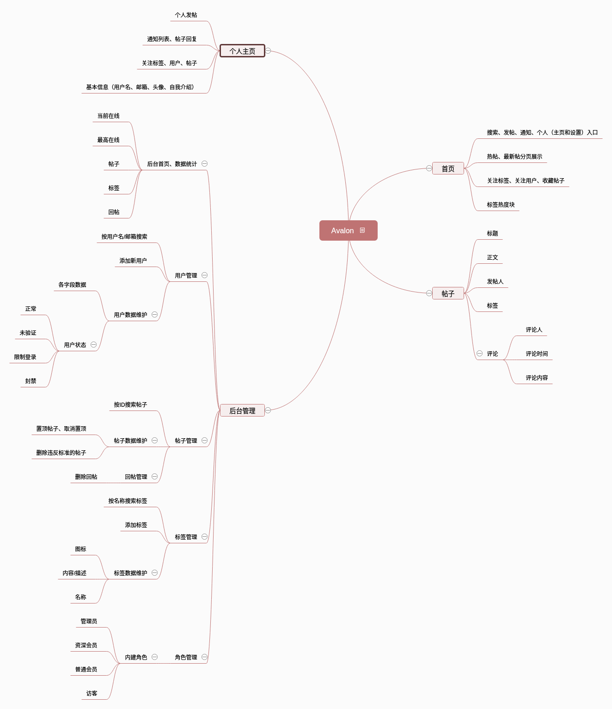

Avalon
----
 

##### 简介
- 一个简单的论坛系统，使用Spring、Spring-MVC、MyBatis构建
- 前端使用BootStrap4、JQuery和Layer弹窗
- 发帖包含markdown解析器
##### [功能脑图](http://naotu.baidu.com/file/db9338d51939d2167a6ba5b6f1251ffa?token=0a7c11b6e3cb2951)

##### 数据库设计
- - - -
:one: 用户表（user）

列名|数据类型|备注|能否为空|默认值
:----:|:----:|:----:|:----:|:----:
pk_uid|unsigned int|用户表主键约束|×|-
uk_username|varchar(20)|用户名，唯一约束|×|-
password|varchar(20)|用户密码|×|-
uk_email|varchar(30)|用户注册邮箱|×|-
self_introduction|varchar(200)|自我介绍|√|-
header|varchar(40)|用户头像|√|default.jpg
tag_ids|varchar(40)|关注标签ID集合|√|"1"（默认关注Java,多个ID之间用-来连接）
gmt_create|date_time|用户创建时间|×|-
gmt_modified|date_time|用户修改时间|×|-|
- - - -

:two: 帖子表（post）

列名|数据类型|备注|能否为空|默认值
:----:|:----:|:----:|:----:|:----:
pk_pid|unsigned int|帖子表主键约束|×|-
u_id|unsigned int|帖子的创建者ID|×|-
title|varchar(30)|帖子的标题|×|-
content|varchar(2000)|帖子的内容|×|-
praise_time|unsigned int|赞的次数|√|0
collection_time|unsigned int|收藏次数|√|0
gmt_create|date_time|帖子创建时间|×|-
gmt_modified|date_time|帖子修改时间|×|-

- - - -

:three: 标签表（tag）

列名|数据类型|备注|能否为空|默认值
:----:|:----:|:----:|:----:|:----:
pk_tag_id|unsigned int|标签表主键约束|×|-
uk_tag_name|varchar(10)|标签名称|×|-
tag_image|varchar(30)|标签图片|×|-
tag_descripe|varchar(30)|标签描述|×|-
gmt_create|date_time|标签创建时间|×|-
gmt_modified|date_time|标签修改时间|×|-

- - - - 

:four: 评论表（comment）

列名|数据类型|备注|能否为空|默认值
:----:|:----:|:----:|:----:|:----:
pk_comment_id|unsigned int|评论表主键约束|×|-
comment_content|varchar(200)|评论的内容|×|-
comment_level|unsigned tinyint|评论的等级（1,2,3）|×|-
u_id|unsigned int|评论的用户ID|×|-
post_id|unsigned int|评论帖子ID|×|-
parent_id|unsigned int|评论的父级ID|×|-
gmt_create|date_time|评论创建时间|×|-
gmt_modified|date_time|评论修改时间|×|-

- - - -
:five: 标签和帖子关系表（tag_post_rel）

列名|数据类型|备注|能否为空|默认值
:----:|:----:|:----:|:----:|:----:
tp_id|unsigned int|主键|×|-
tag_id|unsigned int|关联标签ID|×|-
post_id|unsigned int|关联帖子ID|×|-
gmt_create|date_time|此关系创建时间|×|-
gmt_modified|date_time|此关系修改时间|×|-
- - - -